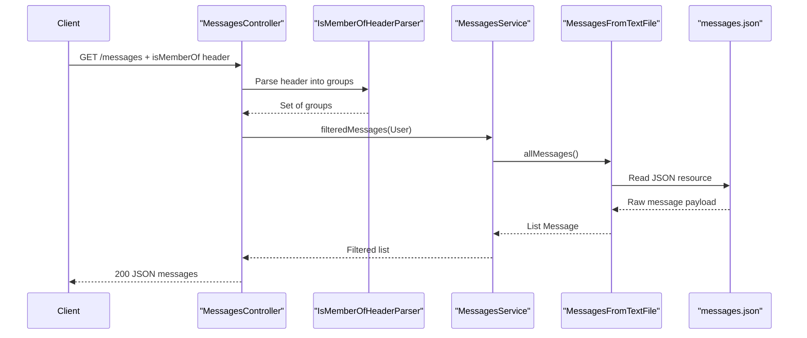

# API & Service Communication Contracts

The API surface is a single REST service with five GET-style endpoints for health, user-scoped message retrieval, and admin message access. Communication is synchronous HTTP with in-process service and repository calls.

## Service Catalog

| Service | Port | Category | Purpose |
|---|---|---|---|
| uportal-messaging (`edu.Application`) | Not explicitly configured (Spring Boot default unless overridden at runtime) | API Layer + Business | Serves message/announcement payloads filtered by user context and message timing |

## API Endpoints Inventory

| Service | Method | Path | Request Type | Response Type |
|---|---|---|---|---|
| uportal-messaging / MessagesController | GET | `/messages` | Header: `isMemberOf` parsed into user group set | `200` JSON object `{ "messages": [Message] }` |
| uportal-messaging / MessagesController | GET | `/admin/allMessages` | None | `200` JSON object `{ "messages": [Message] }` |
| uportal-messaging / MessagesController | GET | `/` | None | `200` JSON object `{ "status": "up" }` |
| uportal-messaging / MessagesController | GET | `/admin/message/{id}` | Path parameter `id` | `200` `Message`; may throw not-found exception |
| uportal-messaging / MessagesController | GET | `/message/{id}` | Path parameter `id`, header `isMemberOf` | `200` `Message`; may throw not-found, audience, premature, or expired exceptions |

## Management & Observability Endpoints

| Service | Endpoint | Custom Metrics (if any) |
|---|---|---|
| uportal-messaging | `/` (custom status endpoint) | None detected |

## DTOs & Contracts

Service-level contract types include `Message` (primary response model), `MessageArray` (container for repository deserialization), `MessageFilter` (audience and date constraints), `ActionButton`, `Data`, and `User` (request-context model derived from headers). All are mutable POJOs serialized/deserialized via Jackson; no immutable Java records are used. No OpenAPI/Swagger files, protobuf schemas, or GraphQL schemas were detected.

## Communication Patterns

The service uses synchronous HTTP between clients and the Spring MVC controller layer, then direct in-process Java method calls from controller to `MessagesService` and then to `MessagesFromTextFile`. No asynchronous messaging, service discovery, API gateway composition, retries, or circuit breakers were found. Startup dependency is minimal because there are no external runtime dependencies beyond classpath resources. Security posture at the API contract layer is limited: no explicit authentication, authorization annotations, or TLS enforcement configuration was detected in the codebase.

## Service Technology Matrix

| Service | Web | Data Access | Discovery | Gateway | Actuator | Cache | Metrics |
|---|---|---|---|---|---|---|---|
| uportal-messaging | Spring MVC | File-based repository + Jackson mapping | None | None | Custom root status endpoint only | None | None |

## Service Communication Sequence

