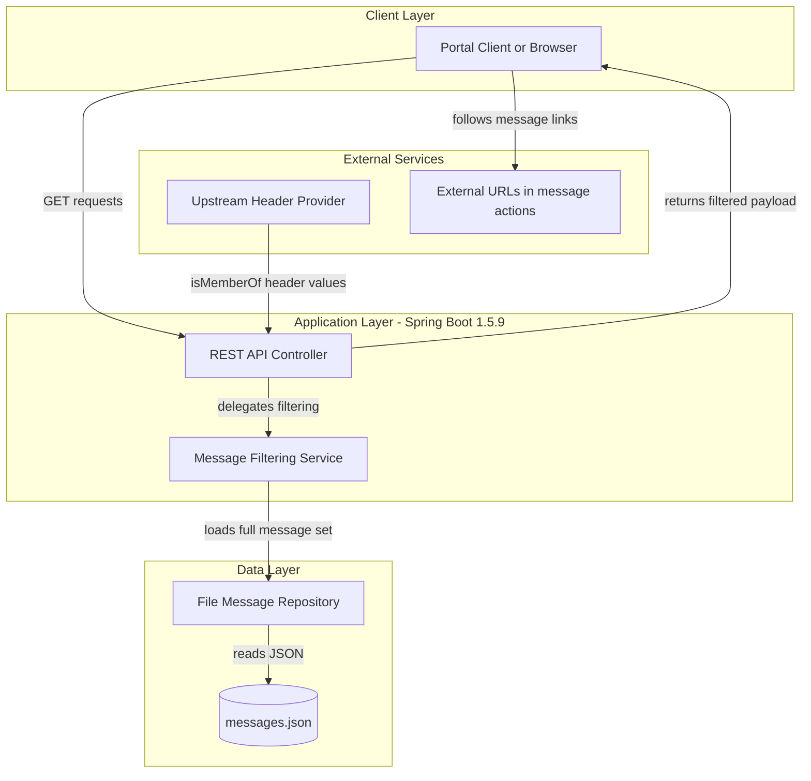
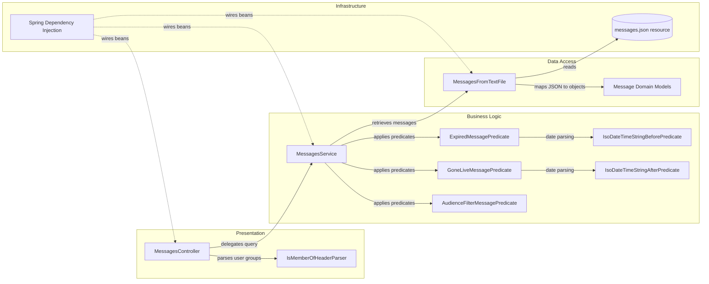

# Architecture Diagram

This project is a Spring Boot messaging microservice that serves JSON message payloads filtered by user audience and message lifetime rules. The architecture is a single deployable unit with in-process business filtering and file-backed message storage.

## Application Architecture

### Technology Stack Summary

| Layer | Technology | Version | Purpose |
|---|---|---|---|
| Presentation | Spring MVC REST (`spring-boot-starter-web`) | Spring Boot 1.5.9.RELEASE | Exposes HTTP endpoints for message retrieval and status |
| Business | Spring Service + Java predicates | Java 8 | Applies audience, go-live, and expiration filtering rules |
| Data Access | Spring `@Repository` + Jackson + org.json + Commons IO | Jackson from Spring Boot BOM; `org.json` 20171018; Commons IO 2.6 | Loads and deserializes message definitions from JSON resource files |
| Runtime | Embedded/provided Tomcat WAR deployment | Spring Boot 1.5.9.RELEASE | Hosts the application as a servlet-based microservice |

### Data Storage & External Services

The service does not use a database, cache, or message broker. Message data is stored in classpath JSON files (`messages.json` by default), and the only external interaction is consumption of request headers from upstream portal components and optional user navigation to URL targets embedded in message action buttons.

### Key Architectural Decisions

- Uses file-backed content (`message.source`) instead of a relational or NoSQL persistence layer.
- Keeps filtering logic in predicate-based service components to enforce consistent audience and date checks.
- Exposes both user-scoped and admin endpoints from a single REST controller for operational simplicity.

## Component Relationships

### Component Inventory

| Component | Layer | Type | Responsibility |
|---|---|---|---|
| MessagesController | Presentation | Spring REST Controller | Handles status and message retrieval endpoints |
| IsMemberOfHeaderParser | Presentation | Utility Component | Converts semicolon-delimited membership header into group set |
| MessagesService | Business Logic | Spring Service | Orchestrates retrieval and filtering of messages for user/admin flows |
| AudienceFilterMessagePredicate | Business Logic | Predicate | Checks whether a user belongs to required message groups |
| GoneLiveMessagePredicate | Business Logic | Predicate | Validates go-live eligibility against current time |
| ExpiredMessagePredicate | Business Logic | Predicate | Flags expired messages based on configured expiration date |
| IsoDateTimeStringAfterPredicate / BeforePredicate | Business Logic | Predicate Utilities | Parses ISO date strings and performs temporal comparisons |
| MessagesFromTextFile | Data Access | Spring Repository | Loads JSON message source and maps into message model objects |
| Message, MessageFilter, MessageArray, Data, ActionButton, User | Data Access | Domain/DTO Models | Represent API payload, filtering metadata, and user context |
