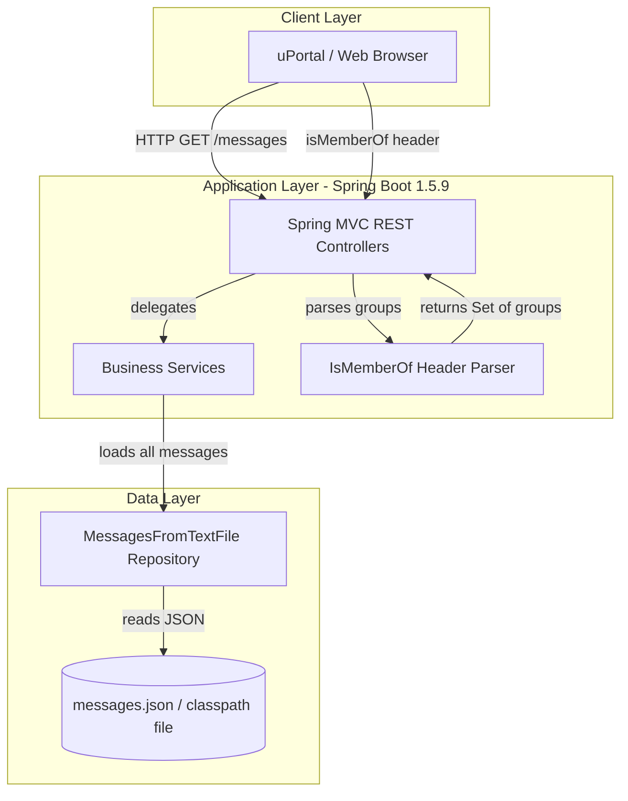
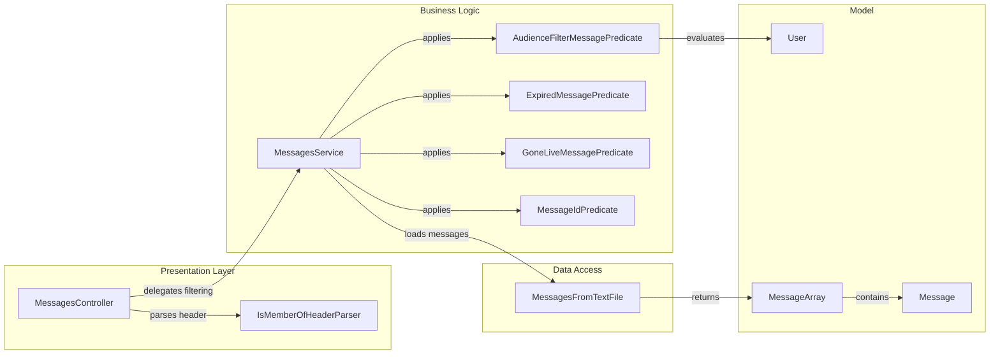

# Architecture Diagram

This document describes the architecture of the uPortal Messaging microservice, a Spring Boot REST API that serves filtered messages to portal users based on group membership and message scheduling rules.

## Application Architecture

### Technology Stack Summary

| Layer | Technology | Version | Purpose |
|---|---|---|---|
| Presentation | Spring MVC REST | 1.5.9 | RESTful HTTP endpoints |
| Business Logic | Spring Boot Service | 1.5.9 | Message filtering, predicates |
| Data Access | Spring Repository | 1.5.9 | JSON file loading via ResourceLoader |
| Runtime | Embedded Tomcat (WAR) | 8.x | Servlet container |
| Serialization | Jackson ObjectMapper | 2.x | JSON deserialization |
| Utilities | Apache Commons IO / Lang3 | 2.6 / 3.7 | IO and string utilities |
| Build | Maven | 3.x | Dependency management, WAR packaging |

### Data Storage & External Services

The application has no relational database or external service dependencies. All message data is stored in a static `messages.json` file deployed on the classpath, configured via the `message.source` property in `application.properties`. There is no cache, message broker, or external API integration. The only external input per request is the `isMemberOf` HTTP header that carries the requesting user's group memberships.

### Key Architectural Decisions

- **Flat-file data source**: Messages are loaded from a JSON file on every request via `MessagesFromTextFile`, making the data layer trivially simple but requiring redeployment to update message content.
- **Predicate-based filtering**: Message visibility rules (audience, expiry, not-before) are implemented as composable `java.util.function.Predicate<Message>` objects, enabling flexible composition without complex query logic.
- **WAR packaging for container deployment**: Despite being a Spring Boot application, the project is packaged as a WAR for deployment into an external Tomcat container (typical for uPortal environments).

## Component Relationships

### Component Inventory

| Component | Layer | Type | Responsibility |
|---|---|---|---|
| MessagesController | Presentation | Spring REST Controller | Handles HTTP endpoints: /messages, /admin/allMessages, /message/{id}, /admin/message/{id} |
| IsMemberOfHeaderParser | Presentation | Spring Component | Parses semicolon-delimited isMemberOf header into a Set of group strings |
| MessagesService | Business Logic | Spring Service | Orchestrates message retrieval and applies predicate-based filtering rules |
| AudienceFilterMessagePredicate | Business Logic | Predicate | Filters messages to those whose audience includes the requesting user's groups |
| ExpiredMessagePredicate | Business Logic | Predicate | Filters out messages past their not-after date |
| GoneLiveMessagePredicate | Business Logic | Predicate | Filters out messages before their not-before date |
| MessageIdPredicate | Business Logic | Predicate | Matches a message by its unique ID |
| MessagesFromTextFile | Data Access | Spring Repository | Loads and deserializes the messages JSON file from the classpath |
| Message | Model | POJO | Represents a single portal message with metadata and content |
| User | Model | POJO | Represents the requesting user with their group memberships |
| MessageArray | Model | POJO | Wrapper for deserializing the JSON messages array |
| MessageFilter | Model | POJO | Encapsulates filter criteria |
| ActionButton | Model | POJO | Represents an action button on a message |
| Data | Model | POJO | Represents additional data payload on a message |
