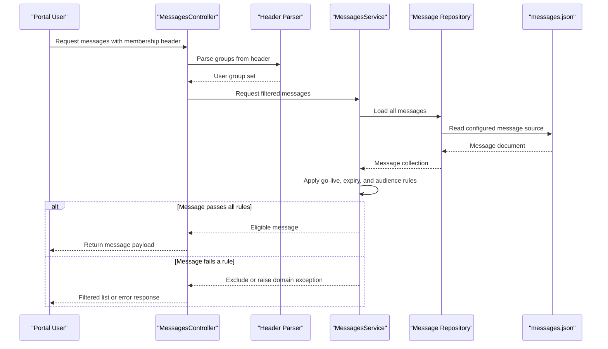

# Core Business Workflows

The application provides user-facing notification and announcement retrieval workflows for portal clients, with filtering based on audience group membership and message timing rules. It also provides admin workflows for unfiltered content inspection.

## Domain Entities

| Entity | Service / Bounded Context | Description | Key Relationships |
|---|---|---|---|
| Message | uportal-messaging / Messaging Delivery | Primary business object representing a notification or announcement | Linked to MessageFilter, Data, and optional action buttons |
| MessageFilter | uportal-messaging / Audience & Timing Rules | Defines go-live, expiration, and audience constraints | Evaluated against User group memberships and current time |
| User | uportal-messaging / Request Context | Represents caller context derived from membership headers | Used to test MessageFilter audience eligibility |
| ActionButton | uportal-messaging / Engagement Actions | Defines user action links for messages | Embedded in Message as action/moreInfo/confirm variants |
| Data | uportal-messaging / Dynamic Payload Metadata | Holds optional payload references and display metadata | Embedded in Message for client-side rendering behaviors |

## Service-to-Domain Mapping

| Service | Domain Context | Owned Entities | External Dependencies |
|---|---|---|---|
| uportal-messaging | Messaging Delivery and Eligibility Filtering | Message, MessageFilter, User context, ActionButton, Data | Consumes `isMemberOf` header from caller and loads JSON content from configured classpath resource |

## Primary Workflows

### Workflow 1: Retrieve filtered message list for a user

Entry point: `GET /messages`.
1. Controller reads `isMemberOf` header and converts it into user group context.
2. Service loads complete message set from repository.
3. Service applies date and audience predicates to remove ineligible messages.
4. API returns only messages that are currently live, not expired, and visible to user groups.

### Workflow 2: Retrieve message by id with user eligibility checks

Entry point: `GET /message/{id}`.
1. Controller builds user context from header and requests message by id.
2. Service validates that the message exists.
3. Service evaluates business checks in sequence: go-live check, expiration check, audience check.
4. Service returns message if all checks pass; otherwise throws a domain-specific exception.

### Workflow 3: Administrative retrieval without filtering

Entry points: `GET /admin/allMessages`, `GET /admin/message/{id}`.
1. Controller bypasses audience/date eligibility logic.
2. Service returns complete list or direct id match.
3. Not-found id requests produce a not-found exception.

## Cross-Service Data Flows

No multi-service aggregation flow exists in this codebase. Business data flow is single-service: request context headers and path parameters are combined with locally stored JSON message content, then transformed into filtered response payloads.

## Business Workflow Sequence

## Business Rules & Decision Logic

- Audience rule: a message with a null group filter is visible to all users; an empty group list is visible to none; otherwise user must share at least one required group.
- Temporal rule: messages are eligible only after go-live date and before expiration date; invalid date data is treated conservatively (excluded or treated as expired/premature based on predicate behavior).
- Identity rule: message IDs are expected to be unique; duplicate IDs produce an illegal state exception.
- Error signaling: business rejection paths are represented using specific exceptions (`PrematureMessageException`, `ExpiredMessageException`, `UserNotInMessageAudienceException`, `MessageNotFoundException`).
