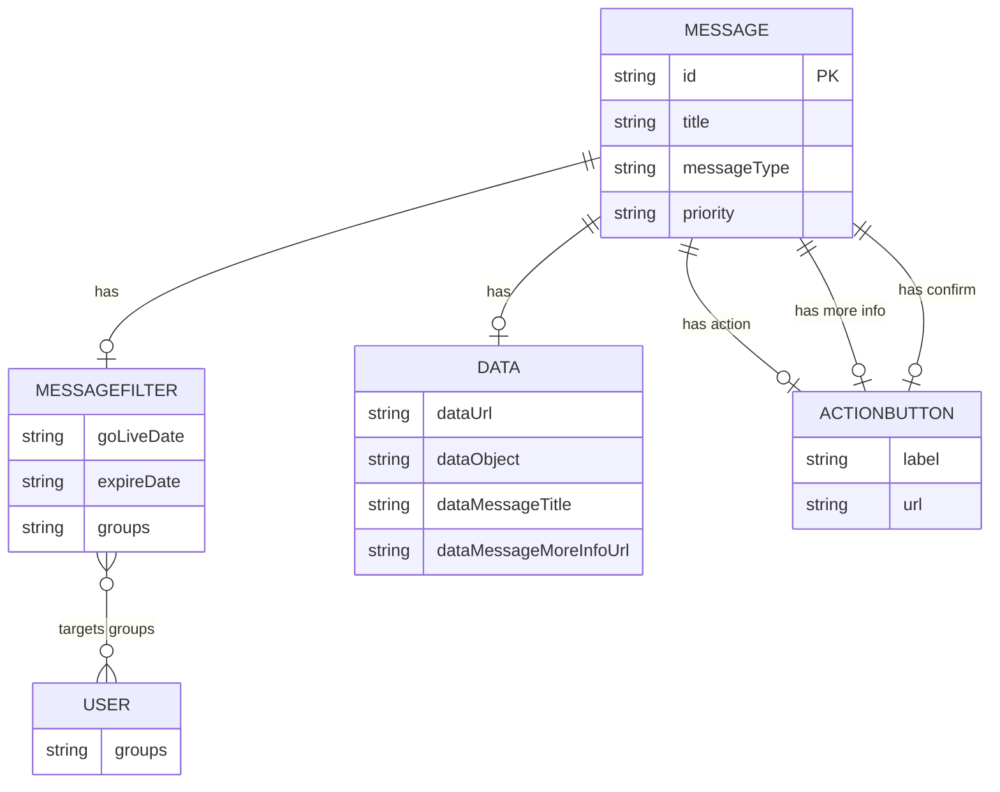

# Data Architecture & Persistence Layer

The data layer is model-centric and file-backed, with six primary domain/data classes and no relational or NoSQL database engine. Persistence is implemented through JSON resource loading rather than ORM-managed entities.

## Database Configuration

| Service/Module | DB Type | Profile | Driver | Connection | Migration Tool |
|---|---|---|---|---|---|
| uportal-messaging | None (file-based storage) | default | None | Classpath resource (`messages.json` via `message.source`) | None |

## Data Ownership per Service

| Service | Tables Owned | ORM Framework | Caching | Notes |
|---|---|---|---|---|
| uportal-messaging | None | None | None | Owns JSON message document structure loaded through repository class |

## Entity Model

## Key Repository Methods

| Service | Repository | Notable Methods | Purpose |
|---|---|---|---|
| uportal-messaging | `MessagesFromTextFile` (`src/main/java/edu/wisc/my/messages/data/MessagesFromTextFile.java`) | `allMessages()` | Resolves configured resource path, reads JSON, deserializes into `MessageArray`, returns list |
| uportal-messaging | N/A (service-level retrieval) | `MessagesService.messageById(String)` | Performs in-memory lookup for specific message IDs |
| uportal-messaging | N/A (service-level retrieval) | `MessagesService.filteredMessages(User)` | Applies audience and temporal predicates over in-memory message list |

## Caching Strategy

No explicit caching provider or cache abstraction is configured (`@Cacheable`, Redis, EhCache, Caffeine not detected). Each request reads and deserializes message data through the repository call path.

## Data Ownership Boundaries

Data ownership is isolated to a single service and a single file-backed source. There is no shared database across services and no cross-service query path. Read patterns are request-time retrieval plus in-memory filtering; write/CQRS separation is not implemented in this codebase.

### Data Classification & Sensitivity

| Entity | Sensitive Fields | Classification (PII/PHI/PCI/None) | Controls in Place |
|---|---|---|---|
| MESSAGE | Audience group names, optional external URLs | Potentially sensitive metadata | No explicit encryption-at-rest, masking, or field-level access controls detected |
| USER | Group memberships from request header | Potential identity/authorization metadata | Processed in-memory only; no explicit protection controls configured |
| MESSAGEFILTER / DATA / ACTIONBUTTON | None clearly PII/PHI/PCI by default | None | Not applicable |
