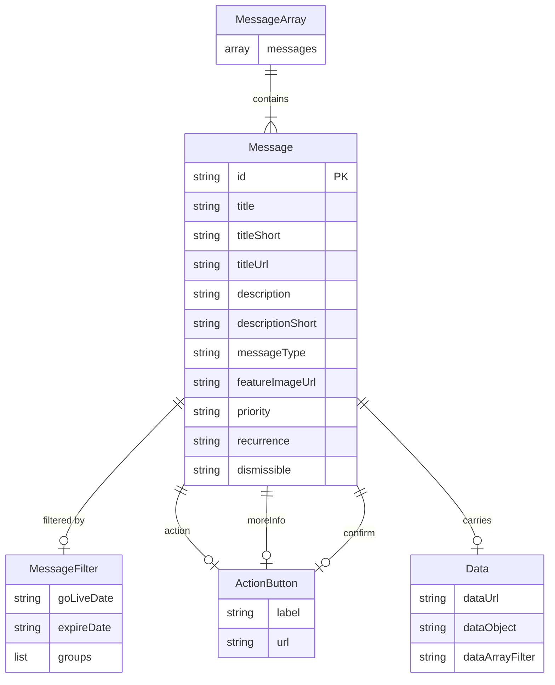

# Data Architecture & Persistence Layer

The uPortal Messaging application has no relational database. All data is held in a single JSON file on the classpath, deserialized via Jackson into 4 model classes (Message, MessageFilter, ActionButton, Data); no ORM framework is used.

## Database Configuration

| Service/Module | DB Type | Profile | Driver | Connection | Migration Tool |
|---|---|---|---|---|---|
| uportal-messaging | JSON flat file | All (single profile) | None (classpath ResourceLoader) | `message.source=classpath:messages.json` | None — file is updated manually and redeployed |

There is no relational database, JDBC driver, connection pool, or schema migration tool. The data store is a static JSON file bundled with the WAR artifact.

## Data Ownership per Service

| Service | Entities Owned | ORM Framework | Caching | Notes |
|---|---|---|---|---|
| uportal-messaging | Message, MessageFilter, ActionButton, Data | None (Jackson deserialization only) | None | File is read on every request; no write capability exists |

## Entity Model

## Key Repository Methods

| Service | Repository | Notable Methods | Purpose |
|---|---|---|---|
| uportal-messaging | MessagesFromTextFile | `allMessages()` | Reads and deserializes the entire messages JSON file from classpath on every call |

There are no Spring Data `JpaRepository` or `CrudRepository` interfaces. The sole data-access class is `MessagesFromTextFile`, a Spring `@Repository` bean that uses Spring's `ResourceLoader` and `Environment` to locate and stream-read the configured JSON file, then deserializes it with Jackson's `ObjectMapper` into a `MessageArray` wrapper. There are no custom query methods, no pagination, and no write operations.

## Caching Strategy

No caching is implemented. The `MessagesFromTextFile.allMessages()` method reads and deserializes the JSON file on every invocation, including for every incoming HTTP request. There are no `@Cacheable` annotations, no Spring Cache configuration, no EhCache, Redis, or Caffeine dependency, and no second-level cache. For a read-only file-based data store with infrequent changes, introducing a startup-time or timed-expiry in-memory cache would be a low-risk performance improvement.

## Data Ownership Boundaries

The application is a single deployable unit with a single, wholly-owned data store. There are no cross-service data access patterns, no shared database, and no inter-service queries. The JSON file is exclusively read (never written) by this service; updates require repackaging and redeployment of the WAR.

Because all data is static and file-based, there are no CQRS, event sourcing, or outbox patterns in use. Read patterns are simple full-collection loads with in-memory filtering.

### Data Classification & Sensitivity

| Entity | Sensitive Fields | Classification | Controls in Place |
|---|---|---|---|
| Message | title, description, titleUrl, actionButton.url | None — content is public portal announcements | N/A |
| MessageFilter | groups | None — group names are organizational labels, not personal data | N/A |
| User | groups | None — transient request-scope object, never persisted | N/A |

No PII, PHI, or PCI data is stored or processed. The `User` object is a transient, per-request model constructed from the `isMemberOf` HTTP header and is never serialized to disk or a database. Message content is public-facing portal announcements. No encryption-at-rest, data masking, or field-level access controls are required or implemented.
