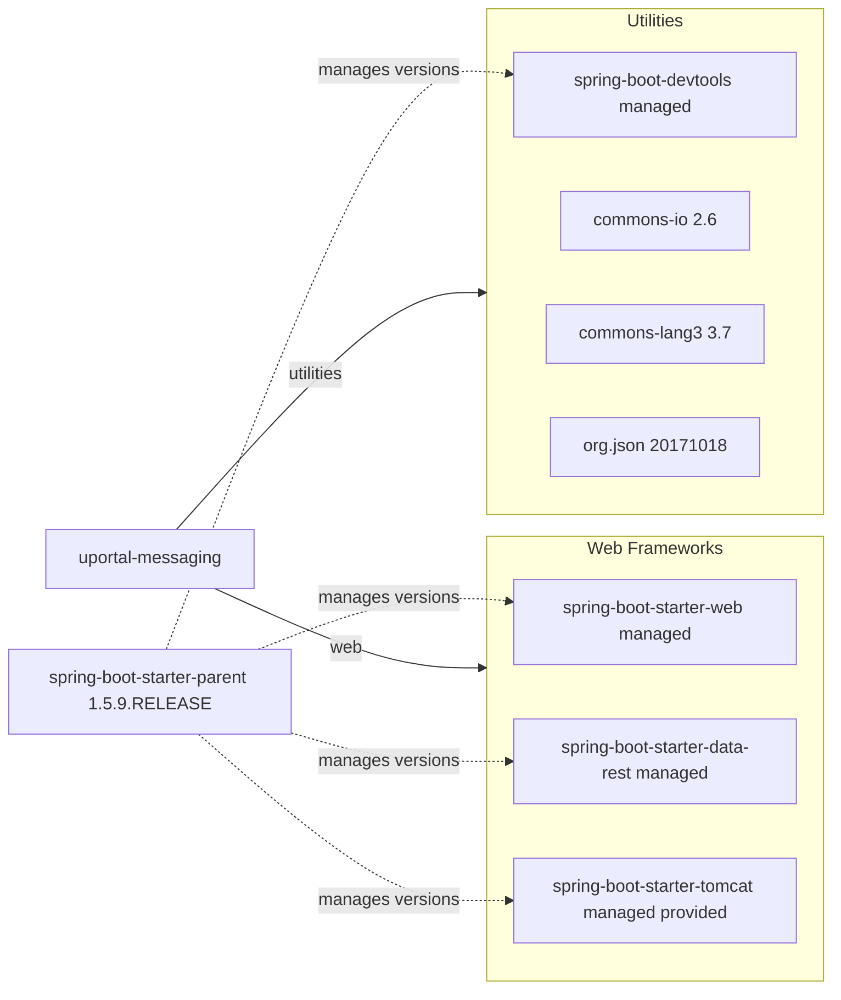

# Dependency Map

This project (`uportal-messaging`) declares 7 main Maven dependencies (excluding test scope), centered on Spring Boot web delivery and JSON/file processing utilities.

## Dependencies

### Dependency Summary

| Category | Count | Key Libraries | Notes |
|---|---:|---|---|
| Web Frameworks | 3 | spring-boot-starter-web, spring-boot-starter-data-rest, spring-boot-starter-tomcat | Core HTTP and servlet stack; Tomcat is provided for WAR deployment |
| Utilities | 4 | spring-boot-devtools, commons-io, commons-lang3, org.json | Supports development reloads and JSON/file parsing logic |
| Database / ORM | 0 | None | No JDBC or ORM dependency declared |
| Messaging | 0 | None | No broker or queue client dependencies |
| Caching | 0 | None | No cache library configured |
| Logging | 0 | Managed transitively | Logging provided transitively by Spring Boot starter stack |
| Security | 0 | None | No explicit Spring Security starter declared |
| Observability | 0 | None | No actuator/metrics exporter dependency declared |

### Version & Compatibility Risks

The project is pinned to Spring Boot `1.5.9.RELEASE` and Java `1.8`, both significantly behind current supported major versions, which raises compatibility and security-maintenance risks. The legacy `org.json` and older Apache Commons versions may also require review for modern runtime compatibility.

### Notable Observations

- Version management is inherited from the Spring Boot parent BOM rather than explicitly pinned for most starters.
- No direct persistence dependency is present; data is file-backed rather than database-backed.
- The service includes `spring-boot-devtools` in main dependencies, which is unusual for production deployments.

## Test Dependencies

| Framework | Version | Notes |
|---|---|---|
| spring-boot-starter-test | Managed by Spring Boot 1.5.9.RELEASE | Provides JUnit/Mockito/assertion tooling via Spring Boot test bundle |

Total test-scope dependencies: 1
The project has a defined unit/integration test stack through Spring Boot test starter, but it does not declare modern contract-testing or containerized integration-testing libraries directly.
