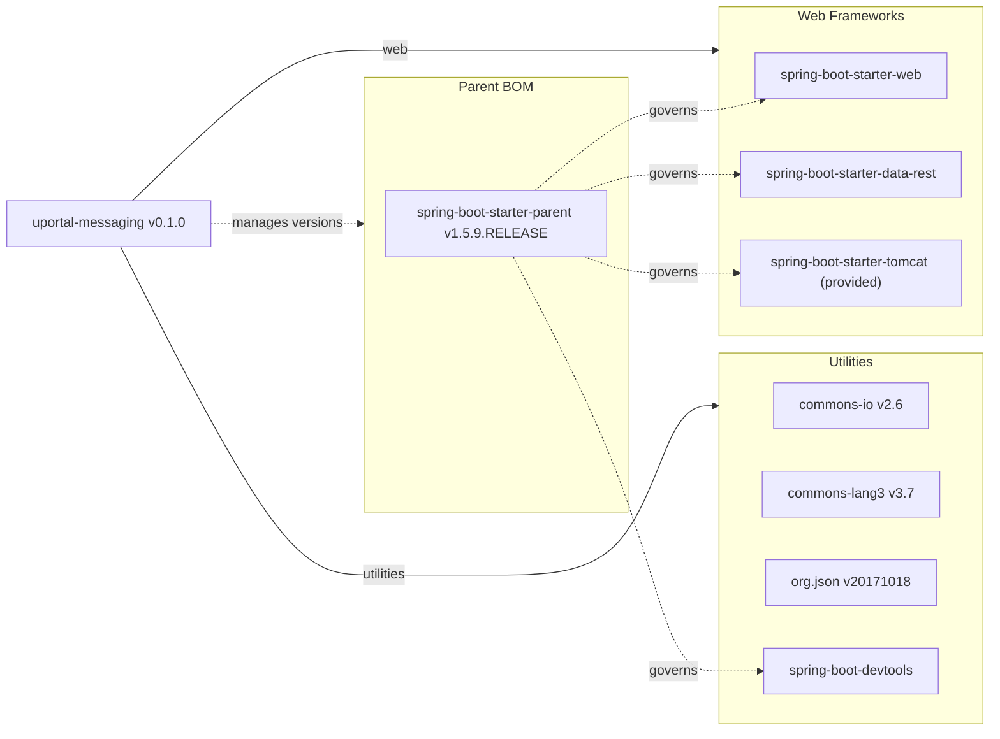

# Dependency Map

The uPortal Messaging project declares 10 direct dependencies (7 runtime/compile + 1 provided + 1 test + 1 dev-tools), managed via Maven with Spring Boot 1.5.9 as the parent BOM.

## Dependencies

### Dependency Summary

| Category | Count | Key Libraries | Notes |
|---|---|---|---|
| Web Frameworks | 3 | spring-boot-starter-web, spring-boot-starter-data-rest, spring-boot-starter-tomcat | Tomcat is provided scope (external container); Data REST adds HATEOAS support |
| Utilities | 4 | commons-io 2.6, commons-lang3 3.7, org.json 20171018, spring-boot-devtools | org.json used for JSON parsing; devtools for hot-reload in development |

### Version & Compatibility Risks

Spring Boot 1.5.9.RELEASE reached end-of-life in August 2019 and is no longer receiving security patches. It depends on Spring Framework 4.3.x which is also end-of-life. The `org.json` library version `20171018` is over 6 years old and there have been many patch releases since. Apache Commons IO 2.6 and Commons Lang3 3.7 are outdated (current versions are 2.16+ and 3.14+ respectively). The project targets Java 1.8, which while still in long-term support via vendors, means it cannot take advantage of modern Java features (records, sealed classes, etc.) available since Java 11/17. Upgrading to Spring Boot 3.x would require migrating to Java 17+ and replacing `javax.*` imports with `jakarta.*`.

### Notable Observations

- **No database dependency**: The application has zero persistence framework dependencies — all data comes from a static JSON file on the classpath, which is a significant architectural constraint and limits dynamic content.
- **Spring Data REST included but underutilized**: `spring-boot-starter-data-rest` is declared but the application uses plain Spring MVC controllers; the HATEOAS/HAL capabilities of Spring Data REST appear unused.
- **No security library**: There is no Spring Security or any authentication/authorization library in the dependencies. Access control relies entirely on the presence and content of the `isMemberOf` HTTP header, which is trusted implicitly.
- **org.json alongside Jackson**: Both `org.json` (for parsing) and Jackson (via Spring Boot) are on the classpath for JSON handling, which is redundant — the code could use Jackson's ObjectMapper exclusively.

## Test Dependencies

| Framework | Version | Notes |
|---|---|---|
| spring-boot-starter-test | Managed by Spring Boot 1.5.9 BOM | Includes JUnit 4, Mockito, Spring Test, Hamcrest, AssertJ |

Total test-scope dependencies: 1 (bundle; resolves to ~6 test libraries transitively)

The project uses the standard Spring Boot test starter which bundles JUnit 4 (not JUnit 5), Mockito, Spring Test (MockMvc), Hamcrest, and AssertJ. There is no separate integration-test framework beyond Maven Failsafe plugin and Spring Boot's `@SpringBootTest`. The project has not adopted JUnit 5 / Jupiter, which would be required for a Spring Boot 3.x upgrade.
